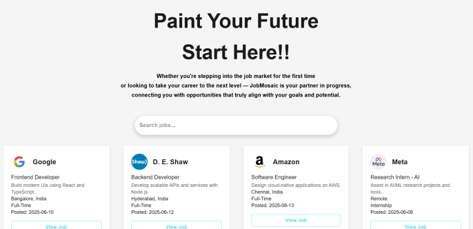
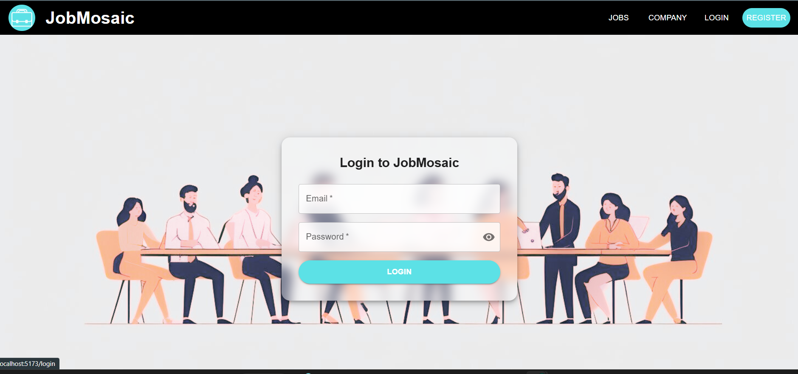
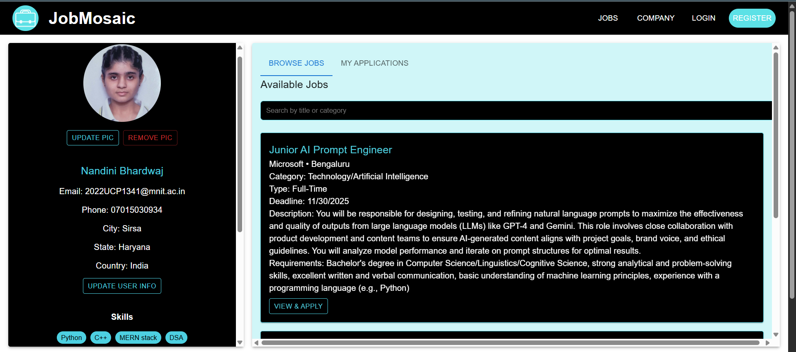
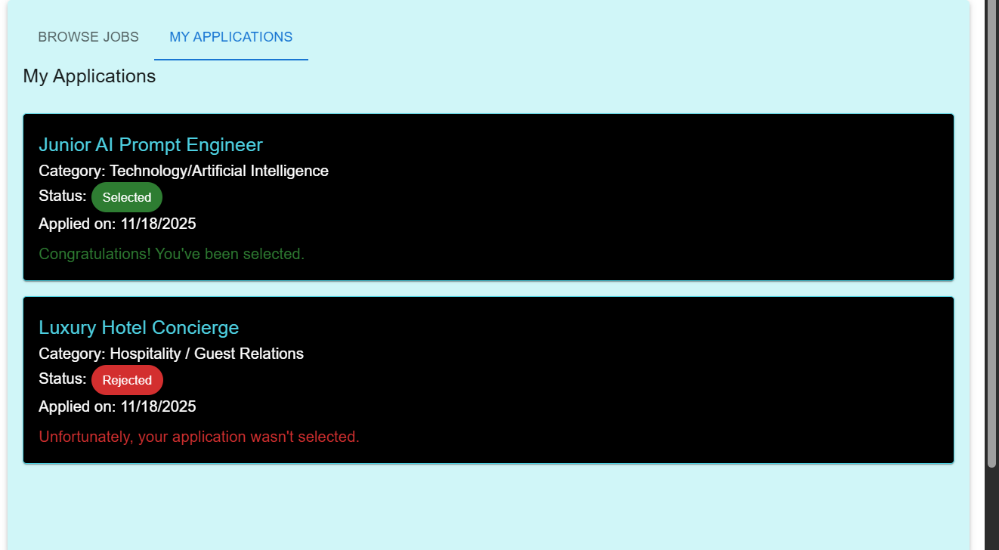
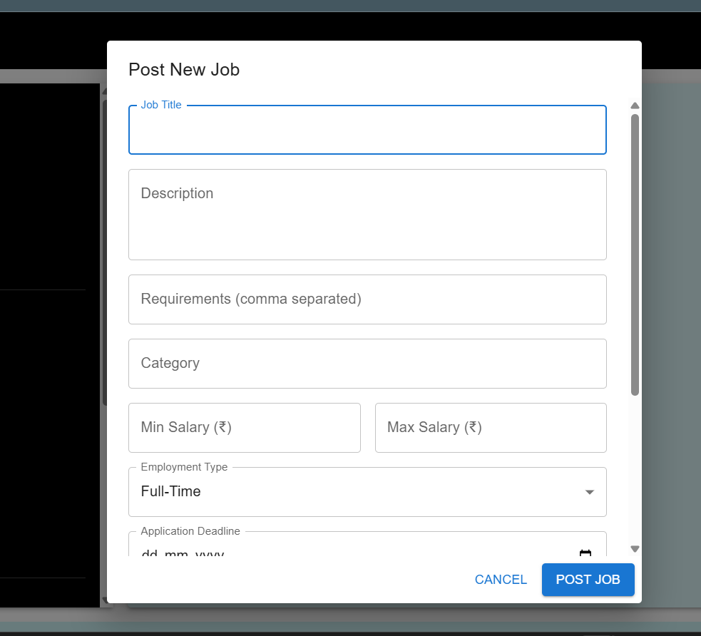
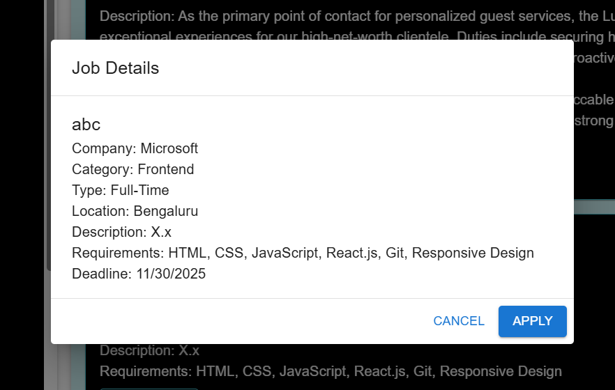

# JobMosaic – Role-Based Job Platform


A role-based job application platform where employees can apply to jobs and employers can manage applications in real time — built with React, Node.js, and MongoDB.

---

## 🔧 Tech Stack


- **Frontend**: React.js, Material UI
- **Backend**: Node.js, Express.js
- **Database**: MongoDB (with Mongoose)
- **Other Tools**: Axios, Cloudinary, Socket.io (if used)

---

## 🚀 Features

### 👤 Employee Panel
- Register and login as Employee
- Browse jobs and apply
- Track application status in real time
- Update profile and upload resume

### 🧑‍💼 Employer Panel
- Register and login as Employer
- Post, update, or delete job listings
- View applicants and their resumes
- Accept or reject applications

### ⚙️ Platform
- Role-based login system
- Real-time UI updates
- Clean dark theme and responsive UI

---

## 📁 Folder Structure
```
jobmosaic/
├── backend/
│ ├── config/
│ │ ├── db.js
│ │ └── cloudinary.js (if used)
│ ├── controllers/
│ │ ├── authController.js
│ │ ├── employeeController.js
│ │ ├── employerController.js
│ │ ├── jobController.js
│ │ └── applicationController.js
│ ├── middleware/
│ │ ├── authMiddleware.js
│ │ ├── multer.js
│ │ └── errorHandler.js
│ ├── models/
│ │ ├── User.js
│ │ ├── Employee.js
│ │ ├── Employer.js
│ │ ├── JobPost.js
│ │ └── JobApplication.js
│ ├── routes/
│ │ ├── authRoutes.js
│ │ ├── employeeRoutes.js
│ │ ├── employerRoutes.js
│ │ ├── jobRoutes.js
│ │ └── applicationRoutes.js
│ ├── uploads/
│ │ ├── resumes/
│ │ └── profilePics/
│ ├── .env
│ ├── server.js
│ └── package.json
│
├── frontend/
│ ├── public/
│ │ └── vite.svg
│ ├── src/
│ │ ├── assets/
│ │ ├── components/
│ │ │ ├── Navbar.jsx
│ │ │ ├── JobCard.jsx
│ │ │ ├── UpdateUserDialog.jsx
│ │ │ └── CropDialog.jsx
│ │ ├── pages/
│ │ │ ├── Register.jsx
│ │ │ ├── Login.jsx
│ │ │ ├── EmployeeDetails.jsx
│ │ │ ├── EmployerDetails.jsx
│ │ │ ├── Dashboard.jsx
│ │ │ ├── Applications.jsx
│ │ │ ├── JobList.jsx
│ │ │ └── JobPostForm.jsx
│ │ ├── data/
│ │ │ ├── jobs.js
│ │ │ └── companies.js
│ │ ├── utils/
│ │ │ └── axios.js
│ │ ├── App.jsx
│ │ ├── App.css
│ │ └── index.jsx
│ ├── .env
│ ├── vite.config.js
│ ├── package.json
│ └── README.md
│
└── README.md
```
## 🛠️ Setup Instructions

### 📦 Backend

```bash
cd backend
npm install
npm run dev
```
### Make sure you have .env file in your root folder with
```
MONGO_URI=your_mongo_connection
JWT_SECRET=your_jwt_secret
PORT=5000

```
### 📦 Frontend

```bash
cd frontend
npm install
npm run dev

```

---

## 🎨 UI / UX Designs

A quick visual walkthrough of the **Job Platform** application, showcasing key screens and user flows.

### 🏠 Home & 🔐 Authentication
| Home Page | Login Page |
|------------|------------|
|  |  |

---

### 👤 Employee Experience
| Dashboard | Job Listings |
|------------------|------------|
|  |  |

---

### 📝 Job Management
| Job Form | Job Card (Details View) |
|------------|------------|
|  |  |
## 📌 Future Enhancements

- Add real-time notifications with Socket.io
- Email alerts on application status
- Admin dashboard for user/job control
- Job filters by skill/location/experience
- Can be Used AI in it
  
## 🧑‍💻 Author

- **Nandini** – [GitHub Profile](https://github.com/Nandini-Sha)
  
## 📄 License

This project is licensed under the [MIT License](LICENSE).

